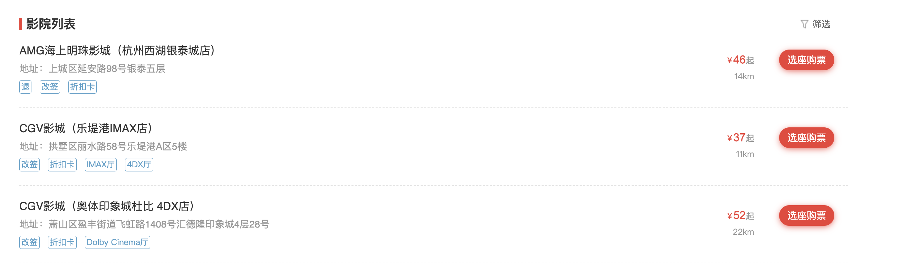
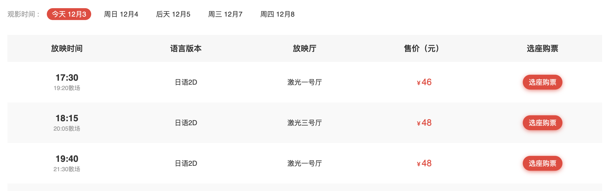
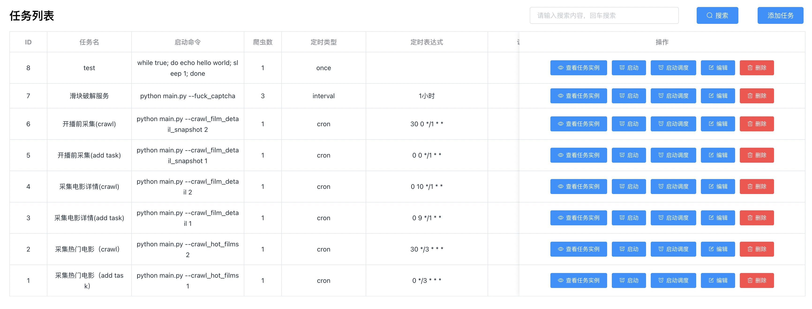

# 猫眼爬虫文档

## 需求

1.  采集各个城市所有热映电影

   

2. 采集电影详情

   1. 电影院信息

      

   2. 场次信息

      

   3. 电影详情

      

3. 采集开播前五分钟的客座率
   

## 调研

滑块：
    
    https://verify.maoyan.com/verify?requestCode=f4ef8ec12328bebe8ac87f36a572c8f2qybqy&redirectURL=https%3A%2F%2Fmaoyan.com%2Fcinema%2F15082%3FmovieId%3D1337700%26poi%3D97314976

破解滑块可解封ip，爬虫无需携带cookie

## 数据库设计

1. maoyan_cinema_list: 影院列表
2. maoyan_city: 城市列表
3. maoyan_film_detail: 电影详情
4. maoyan_film_detail_batch_record：电影详情采集记录
5. maoyan_film_detail_snapshot_task：电影开播前5分钟采集任务
6. maoyan_film_detail_task：电影详情采集任务
7. maoyan_hot_movie_list：热门电影列表
8. maoyan_hot_movie_list_task：热门电影任务

## 爬虫逻辑

1. 读取 maoyan_hot_movie_list_task 任务表，采集热门电影（maoyan_hot_movie_list），同时生产 电影详情采集任务（maoyan_film_detail_task）；采集频率：每天一次；城市在任务表中配置
   
        # 下发任务给爬虫
        python main.py --crawl_hot_films 1
        # 采集
        python main.py --crawl_hot_films 2

2. 读取 maoyan_film_detail_task 采集电影详情（maoyan_film_detail），同时生产电影开播前5分钟采集任务（maoyan_film_detail_snapshot_task）；采集频率：只采一次；品牌可在setting中的BRAND_IDS指定

        # 下发任务给爬虫
        python main.py --crawl_film_detail 1
        # 采集
        python main.py --crawl_film_detail 2

3. 启动个常驻的爬虫，做开播前五分钟的任务，采集电影详情，更新详情表；采集频率，开播前5分钟采集一次

        # 下发任务给爬虫
        python main.py --crawl_film_detail_snapshot 1
        # 采集
        python main.py --crawl_film_detail_snapshot 2

4. 启动滑块破解服务，解封被封掉的ip

        python main.py --fuck_captcha
    
5. 城市id采集（采集一次即可，作为 maoyan_hot_movie_list_task 里的种子任务）

        python main.py --crawl_city

# 部署

1. 安装python3.7、mysql、redis
2. 安装依赖包 pip3 install -r requirements.txt
3. 修改配置文件 setting.py，配置mysql及redis
4. 使用maoyan.sql 创建表
5. 按照上面的爬虫逻辑，启动爬虫

可以使用feaplat部署：

feaplat文档地址：https://boris-code.gitee.io/feapder/#/feapder_platform/%E7%88%AC%E8%99%AB%E7%AE%A1%E7%90%86%E7%B3%BB%E7%BB%9F